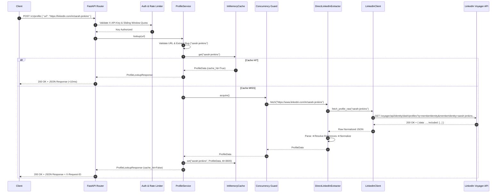

# ProfileForge — Architecture

## 1. System Overview

ProfileForge is a high-reliability, API-first Profile Lookup service built with FastAPI and Python 3.12+. It accepts LinkedIn profile URLs, validates input and enforces SSRF protections, checks an in-memory cache, bounds concurrency, executes direct HTTP communication against LinkedIn's internal Voyager REST API using authorized session credentials, and returns normalized structured JSON conforming to a stable domain schema.

---

## 2. Component Diagram

```mermaid
graph TD
    Client["API Client / Web UI"]
    
    subgraph FastAPI HTTP Layer (app/main.py)
        API["FastAPI App Router"]
        ReqID["Request ID Middleware (X-Request-ID)"]
        LoggingMW["Structured JSON Logging Middleware"]
        AuthMW["API Key Authentication (X-API-Key)"]
        RateLimitMW["Sliding Window Rate Limiter"]
    end
    
    subgraph Service Layer (app/services/)
        URLVal["URL Validator & SSRF Guard (url_utils.py)"]
        ProfileSvc["ProfileService (profile_service.py)"]
        Cache["InMemoryCache with TTL (cache.py)"]
        SingleFlight["Single-Flight Request Coalescing"]
        Sem["Concurrency Semaphore (MAX_CONCURRENT_EXTRACTIONS)"]
    end
    
    subgraph Direct LinkedIn Provider Layer (app/providers/linkedin/)
        ExtIF["ProfileExtractor Protocol (app/extractor/base.py)"]
        DirectExt["DirectLinkedInExtractor (app/extractor/linkedin_direct.py)"]
        ReqBuilder["LinkedInRequestBuilder"]
        ClientHTTP["LinkedInClient (httpx.AsyncClient)"]
        Parser["LinkedInParser (Entity Classification)"]
        Resolver["LinkedInResolver (URN Index & Degree Regex)"]
        Normalizer["LinkedInNormalizer (Domain & Quality Score)"]
    end
    
    subgraph Upstream LinkedIn API
        VoyagerAPI["LinkedIn Voyager API (linkedin.com/voyager/api)"]
    end

    Client -->|HTTPS Request| ReqID
    ReqID --> LoggingMW
    LoggingMW --> AuthMW
    AuthMW --> RateLimitMW
    RateLimitMW --> API
    API --> URLVal
    URLVal --> ProfileSvc
    ProfileSvc --> Cache
    Cache -->|Cache HIT| API
    Cache -->|Cache MISS| SingleFlight
    SingleFlight --> Sem
    Sem --> ExtIF
    ExtIF --> DirectExt
    DirectExt --> ReqBuilder
    ReqBuilder --> ClientHTTP
    ClientHTTP -->|Direct GET + Session Cookie + CSRF| VoyagerAPI
    VoyagerAPI -->>|200 OK + Normalized JSON| ClientHTTP
    ClientHTTP --> Parser
    Parser --> Resolver
    Resolver --> Normalizer
    Normalizer --> ProfileSvc
    ProfileSvc --> Cache
    ProfileSvc --> API
    API --> Client
```

---

## 3. Core Request & Direct HTTP Sequence



---

## 4. Trust Boundaries & Security Architecture

```text
┌─────────────────────────────────────────────────────────────┐
│ EXTERNAL CLIENT (Untrusted)                                 │
│  - Public API Consumer                                      │
│  - Supplies: X-API-Key header, Target Profile URL           │
└──────────────────────────────┬──────────────────────────────┘
                               │ HTTPS
┌──────────────────────────────▼──────────────────────────────┐
│ APPLICATION TRUST DOMAIN (Trusted)                          │
│  - FastAPI Application Server                               │
│  - Constant-time API Key Verification (secrets.compare_digest)
│  - SSRF Verification (Blocks private/loopback/cloud metadata)
│  - Rate Limiting (Sliding window counter)                   │
│  - Single-Flight Request Coalescing & Concurrency Semaphore │
│  - In-Memory Cache (TTL Expiration)                         │
└──────────────────────────────┬──────────────────────────────┘
                               │ HTTPS + Session Cookies
┌──────────────────────────────▼──────────────────────────────┐
│ UPSTREAM PROVIDER BOUNDARY (Semi-Trusted)                   │
│  - Direct HTTP Connection to LinkedIn Voyager API           │
│  - Authenticated via secure environment variables:          │
│    LINKEDIN_LI_AT and LINKEDIN_JSESSIONID                   │
│  - CSRF Token derived from JSESSIONID                       │
│  - Error classification: 401, 403, 404, 429, 999, Redirects │
└─────────────────────────────────────────────────────────────┘
```

---

## 5. Architectural Invariants

1. **Separation of API and Provider**: The HTTP layer knows nothing about LinkedIn Voyager structures or entity representations.
2. **Four-Stage Provider Pipeline**:
   - `Client`: Manages direct HTTP transport, cookies, headers, timeouts, status codes, and challenge detection.
   - `Parser`: Categorizes raw entities from the `included[]` store and detects schema drift.
   - `Resolver`: Resolves entity relationships, foreign URN keys, media URLs, and degree regex patterns.
   - `Normalizer`: Produces domain `ProfileData` and computes objective `DataQuality`.
3. **Single-Flight Request Coalescing**: Concurrent requests for the same uncached profile ID merge into a single in-flight lookup, preventing thundering herds and redundant upstream load.
4. **SSRF Guard**: All incoming URLs are verified against an exact hostname allowlist and checked against IPv4/IPv6 private and link-local ranges before any network dispatch.
