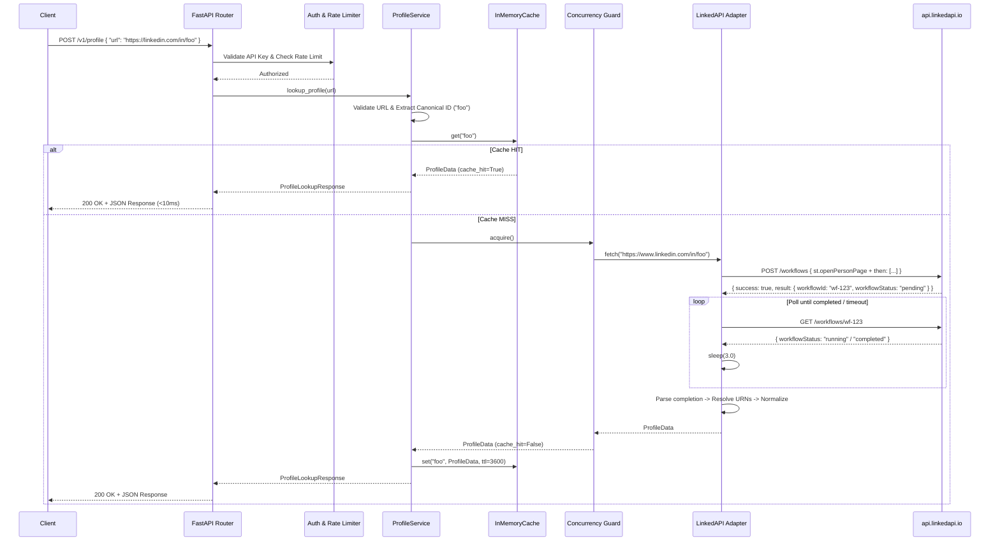

# ProfileForge — Architecture

## 1. System Overview

ProfileForge is a high-reliability Profile Lookup API built with FastAPI. It accepts LinkedIn profile URLs, validates and canonicalizes input, queries an in-memory cache, bounds concurrency, coordinates with an asynchronous upstream workflow engine (LinkedAPI), and returns normalized profile data conforming to a clean, provider-agnostic domain schema.

---

## 2. Component Diagram

```mermaid
graph TD
    Client["API Client / Consumer"]
    
    subgraph FastAPI HTTP Application Layer
        API["FastAPI App (app/main.py)"]
        ReqID["Request ID Middleware"]
        LoggingMW["Structured Logging Middleware"]
        AuthMW["API Key Authentication (X-API-Key)"]
        RateLimitMW["Sliding Window Rate Limiter"]
    end
    
    subgraph Service & Core Layer
        URLVal["URL Validator & SSRF Guard"]
        ProfileSvc["ProfileService"]
        Cache["InMemoryCache (Canonical ID Key)"]
        Sem["Concurrency Semaphore (MAX_CONCURRENT_EXTRACTIONS=2)"]
    end
    
    subgraph Provider Adapter Layer (app/providers/linkedapi)
        ExtIF["ProfileExtractor Protocol"]
        LinkedInExt["LinkedInExtractor"]
        ClientHTTP["LinkedAPIClient (HTTP Submit + Poll)"]
        Parser["LinkedAPIParser (Schema Validation)"]
        Resolver["LinkedAPIResolver (URN & Entity Index)"]
        Normalizer["LinkedAPINormalizer (DataQuality & Domain Map)"]
    end
    
    subgraph Upstream Cloud Service
        RemoteAPI["LinkedAPI Remote API (api.linkedapi.io)"]
    end

    Client -->|HTTPS Request| ReqID
    ReqID --> LoggingMW
    LoggingMW --> AuthMW
    AuthMW --> RateLimitMW
    RateLimitMW --> API
    API --> URLVal
    URLVal --> ProfileSvc
    ProfileSvc --> Cache
    Cache -->|Cache HIT <10ms| API
    Cache -->|Cache MISS| Sem
    Sem --> ExtIF
    ExtIF --> LinkedInExt
    LinkedInExt --> ClientHTTP
    ClientHTTP -->|POST /workflows & GET poll| RemoteAPI
    ClientHTTP --> Parser
    Parser --> Resolver
    Resolver --> Normalizer
    Normalizer --> ProfileSvc
    ProfileSvc --> Cache
```

---

## 3. Core Request & Asynchronous Lifecycle Sequence



---

## 4. Layer Responsibilities & Boundaries

### 4.1 HTTP & Middleware Layer (`app/`)
- **`app/main.py`**: Route definitions (`/v1/profile`, `/healthz`, `/readyz`), global exception handlers.
- **`app/auth.py`**: Fast, constant-time verification of `X-API-Key` headers.
- **`app/rate_limit.py`**: In-memory sliding window rate limiter per API key.
- **`app/logging_config.py`**: Structured JSON logging with `structlog`, request ID tracking, and automatic credential sanitization.

### 4.2 Core Service & Security Layer (`app/services/`)
- **`app/services/url_utils.py`**: Strict LinkedIn URL validation, SSRF defense, loopback/private IP blocking, query parameter stripping, and canonical profile ID extraction.
- **`app/services/profile_service.py`**: Cache coordination, concurrency gating (`asyncio.Semaphore`), and domain error mapping.

### 4.3 Provider Adapter Pipeline (`app/providers/linkedapi/`)
- **`client.py`**: Manages HTTP workflow submission, asynchronous polling with backoff, and terminal failure detection against `https://api.linkedapi.io`.
- **`parser.py`**: Validates raw JSON structures and detects schema drift (`FIELD_NOT_PRESENT` vs `PARSER_FAILURE` vs `UPSTREAM_SCHEMA_CHANGED`).
- **`resolver.py`**: Resolves member URNs, organization URNs, and indexes nested `then[]` action arrays.
- **`normalizer.py`**: Converts raw parsed records into `ProfileData` and computes deterministic `DataQuality` metrics.

### 4.4 Domain Models (`app/models.py`)
- Pydantic v2 domain representations of experiences, educations, languages, certifications, data quality metrics, and standardized error envelopes.

---

## 5. Deployment Topology

```text
┌───────────────────────────────────────────────────────────┐
│                      Render.com                           │
│  ┌─────────────────────────────────────────────────────┐  │
│  │ Docker Container (python:3.12-slim)                 │  │
│  │                                                     │  │
│  │   Uvicorn ASGI Server (Port 10000)                  │  │
│  │   ├── FastAPI HTTP Application                      │  │
│  │   ├── In-Memory Sliding Window Rate Limiter         │  │
│  │   ├── In-Memory Profile Cache (TTL=3600s)           │  │
│  │   └── Asynchronous LinkedAPI HTTP Adapter           │  │
│  │                                                     │  │
│  │   Non-root User: appuser                            │  │
│  │   Environment: API_KEYS, LINKEDAPI_*                │  │
│  └─────────────────────────────────────────────────────┘  │
│  HTTPS Termination (*.onrender.com)                       │
└─────────────────────────────┬─────────────────────────────┘
                              │
                              │ Outbound HTTPS (REST API)
                              ▼
┌───────────────────────────────────────────────────────────┐
│                  api.linkedapi.io                         │
│  Workflow Execution & Cloud Browser Automation Service    │
└───────────────────────────────────────────────────────────┘
```
