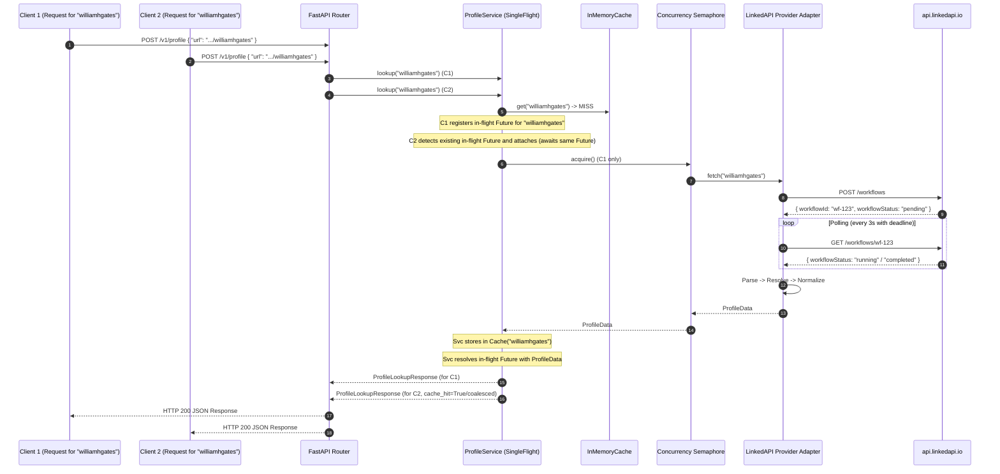

# LinkedAPI Workflow Lifecycle, Retry Policy & Request Coalescing

## 1. Overview

This document details:
1. The asynchronous workflow execution sequence.
2. The deterministic **Retry & Backoff Policy** across transient vs terminal failure states.
3. The **Single-Flight Duplicate Request Protection** (request coalescing) mechanism.

---

## 2. Sequence Diagram with Request Coalescing

---

## 3. Explicit Retry & Backoff Policy

Not all errors are equal. Retrying non-transient errors (like invalid authentication or explicit rate limits) exacerbates upstream penalties and degrades reliability.

### 3.1 Classification Matrix

| Failure Category | HTTP Codes / Errors | Retryable? | Max Attempts | Backoff Strategy | Resulting App ErrorCode |
| :--- | :--- | :--- | :--- | :--- | :--- |
| **Transient Network / DNS** | `ConnectTimeout`, `ReadTimeout`, `ConnectError` | **Yes** | 3 | Exponential with jitter ($2^n \times 0.5s \pm 0.1s$) | `UPSTREAM_TIMEOUT` / `UPSTREAM_SERVER_ERROR` |
| **Upstream Transient 5xx** | `HTTP 502`, `HTTP 503`, `HTTP 504` | **Yes** | 2 | Exponential ($1s, 2s$) | `UPSTREAM_SERVER_ERROR` |
| **Authentication & Config** | `invalidLinkedApiToken`, `subscriptionRequired`, `401`, `403` | **No** | 1 (Fail fast) | None | `AUTH_CONFIGURATION_ERROR` |
| **Rate Limit Exceeded** | `tooManyRequests`, `limitExceeded`, `429` | **No** | 1 (Fail fast) | Respect `Retry-After` if present | `UPSTREAM_RATE_LIMITED` |
| **Terminal Account State** | `linkedinAccountSignedOut`, `outsideWorkingHours` | **No** | 1 (Fail fast) | None | `UPSTREAM_AUTH_FAILED` / `UPSTREAM_CHALLENGE_DETECTED` |
| **Target Profile Missing** | `personNotFound`, `404` | **No** | 1 (Fail fast) | None | `PROFILE_NOT_FOUND` |
| **Schema Validation Drift** | Parser validation exception | **No** | 1 (Fail fast) | None | `UPSTREAM_SCHEMA_CHANGED` |

---

## 4. Single-Flight Duplicate Request Protection

To prevent "cache stampedes" or redundant slow extractions when multiple consumers query the same profile simultaneously:
1. `ProfileService` maintains an internal dictionary `_in_flight: dict[str, asyncio.Future[ProfileData]]`.
2. When a request for canonical profile ID $K$ arrives:
   - If $K$ is in `_in_flight`, the caller simply awaits the existing future.
   - If $K$ is not in `_in_flight`, a new Future is registered, the single upstream extraction workflow executes, populates the cache, resolves the future for all waiters, and removes $K$ from `_in_flight` in a `finally` block.
3. If an extraction fails, the exception propagates to all concurrent waiters cleanly.
