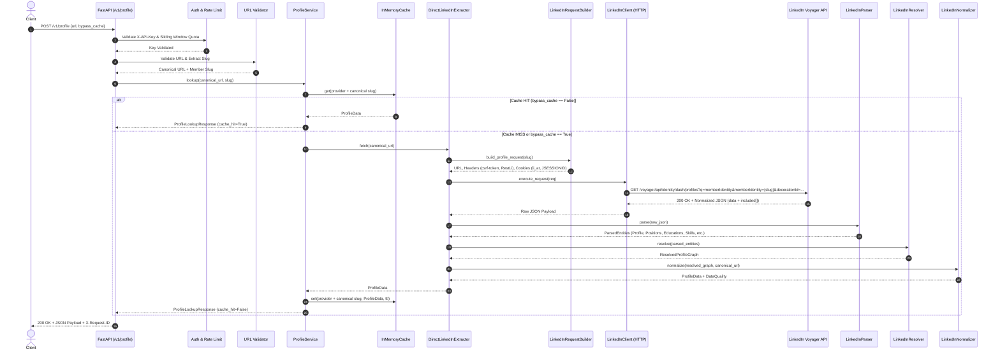
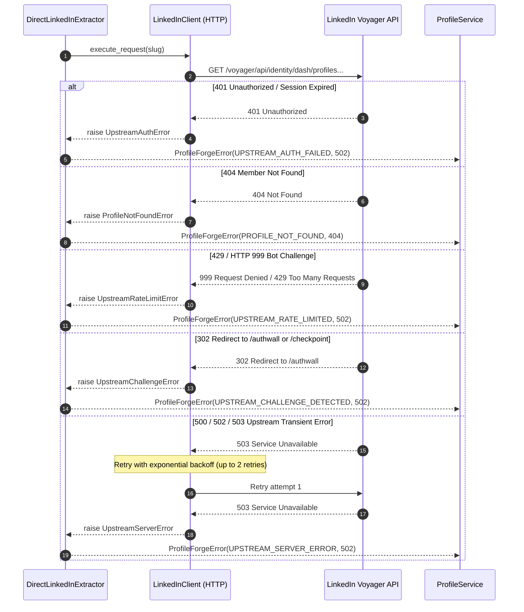

# ProfileForge — Provider Execution Sequence

## 1. Direct Extraction Flow (Happy Path)

The following Mermaid sequence diagram illustrates the lifecycle of a profile lookup request through the direct LinkedIn HTTP architecture:

---

## 2. Upstream Error & Challenge Handling Flow

